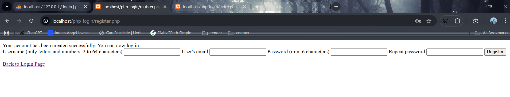
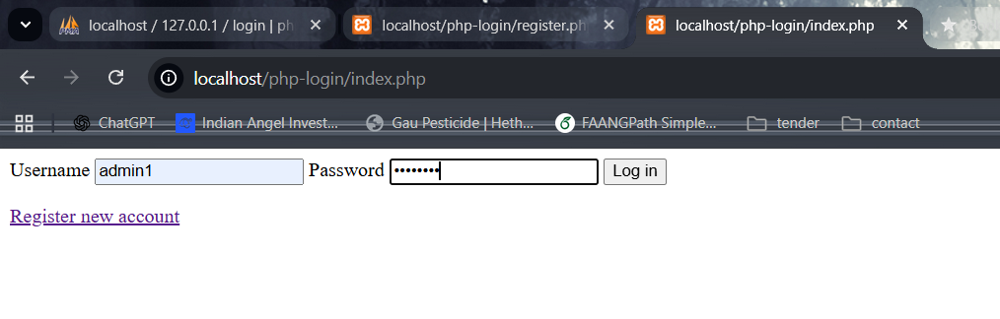
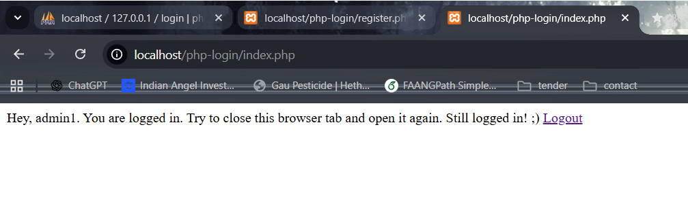
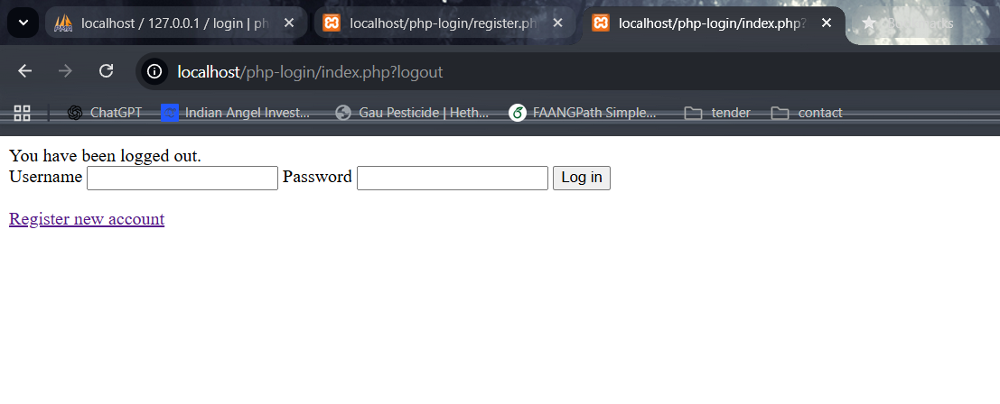

# PHP Login Authentication System

A PHP and MySQL based authentication system that supports user registration and login.  
This project demonstrates backend fundamentals such as database connectivity, password hashing, session handling, and real-world debugging.

## Features
- User registration and login
- Secure password hashing using `password_hash()` and `password_verify()`
- Session-based authentication
- MySQL database integration
- Clean project structure (separation of config, logic, and views)
- Basic input validation and error handling

## Tech Stack
- PHP
- MySQL
- HTML
- CSS
- XAMPP (Apache + MySQL)

## Project Structure
php-login-auth-system/
├── classes/
│ ├── Login.php
│ └── Registration.php
├── config/
│ └── db.example.php
├── views/
│ ├── logged_in.php
│ ├── not_logged_in.php
│ └── register.php
├── index.php
├── register.php
└── README.md

## Setup Instructions
1. Clone the repository into the `htdocs` directory of XAMPP
2. Copy `config/db.example.php` to `config/db.php`
3. Update database credentials in `db.php`
4. Create a MySQL database
5. Import the SQL files from the `_installation` folder
6. Start Apache and MySQL from XAMPP
7. Open the application in your browser

http://localhost/php-login-auth-system/

## Database
The application uses a `users` table with the following fields:
- `user_id`
- `user_name`
- `user_email`
- `user_password_hash`

## What I Learned
- PHP authentication flow
- Secure password storage and verification
- MySQL configuration and debugging
- Handling non-default MySQL ports
- Fixing real-world backend issues related to configuration and paths
## Screenshots

### User Registration

### Login Page

### Logged In State

### Logout

## Author
**Madhusudan Ladda**
